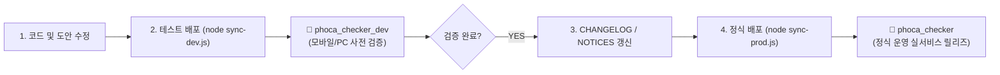

# ✨ 포카 체커 (Phoca Checker)

> **포레스텔라(Forestella) 포토카드 컬렉션 & 위시리스트 생성기**  
> 보유한 포토카드를 클릭하여 체크하고, 1장 개별 고화질 PNG 다운로드 또는 39종 전체 합본 포스터로 내보낼 수 있는 웹 애플리케이션입니다.

---

## 🌐 1. 배포 환경 및 접속 주소

| 환경 | 배포 URL (GitHub Pages) | 레포지토리 | 설명 |
| :--- | :--- | :--- | :--- |
| **🧪 개발 / 테스트 (Dev)** | **[https://foretissimo.github.io/phoca_checker_dev/](https://foretissimo.github.io/phoca_checker_dev/)** | [`phoca_checker_dev`](https://github.com/foretissimo/phoca_checker_dev) | 신규 기능 및 도안 좌표 수정 시 모바일/PC에서 사전 검증 및 QA를 수행하는 독립 환경 |
| **🚀 정식 운영 (Prod)** | **[https://foretissimo.github.io/phoca_checker/](https://foretissimo.github.io/phoca_checker/)** | [`phoca_checker`](https://github.com/foretissimo/phoca_checker) | 사전 검증이 완료된 안정 버전을 사용자에게 정식 제공하는 라이브 실서비스 |

---

## 🚀 2. 앞으로의 작업 및 배포 워크플로우



### 📌 배포 절차 가이드

1. **코드 및 도안 영역 수정**:
   - 로컬 소스 코드(`js/`, `css/`, `index.html`) 수정 또는 브라우저 **[🛠️ 영역 편집기]**에서 카드 박스 드래그&자석 스냅으로 좌표 조정.
2. **테스트 환경 배포 (`node sync-dev.js`)**:
   ```bash
   node sync-dev.js
   ```
   - 테스트용 GitHub Pages([phoca_checker_dev](https://foretissimo.github.io/phoca_checker_dev/))에 즉시 배포됩니다.
   - 스마트폰과 PC 브라우저에서 체크 동작, 다운로드 품질, 화면 깨짐 등을 사전에 꼼꼼히 확인합니다.
3. **변경 이력 문서 갱신**:
   - **기능적인 변경** (UI, 신규 기능, 버그 수정 등) → [`CHANGELOG.md`](./CHANGELOG.md)에 버전별 기록
   - **도안 및 공지 변경** (신규 포카 추가, 수량 변경 등) → [`NOTICES.md`](./NOTICES.md)에 일자별 기록
4. **정식 운영 릴리즈 배포 (`node sync-prod.js`)**:
   ```bash
   node sync-prod.js
   ```
   - 검증이 완료된 소스를 운영 GitHub Pages([phoca_checker](https://foretissimo.github.io/phoca_checker/))로 릴리즈합니다.

---

## 📁 3. 주요 프로젝트 구조

```text
phoca_checker/
├── index.html            # 메인 HTML UI (홈 뷰, 체커 뷰, 공지/도움말 모달, 백업 모달)
├── css/
│   └── style.css         # 테마 디자인 및 반응형 스타일
├── js/
│   ├── templates.js      # 39종 포토카드 템플릿 메타데이터 및 정밀 좌표 데이터
│   ├── app.js            # 뷰 라우팅, 로컬스토리지 상태 관리, 모달 제어, 백업/복원
│   ├── editor.js         # 드래그 앤 드롭 마그넷 자석 스냅 시각적 영역 편집기
│   └── canvas-export.js  # 고화질 PNG 렌더링 (1장 개별 및 39종 전체 합본 포스터)
├── images/
│   └── fore/             # 39종 포토카드 원본 웹 최적화 이미지
├── CHANGELOG.md          # 기능 개발 및 시스템 변경 이력
├── NOTICES.md            # 사용자 공지사항 및 도안 업데이트 관리 이력
├── sync-dev.js           # 테스트 환경(phoca_checker_dev) 배포 스크립트
├── sync-prod.js          # 운영 환경(phoca_checker) 릴리즈 배포 스크립트
└── sync.js               # GitHub Pages REST API 동기화 엔진
```

---

## 👥 4. 만든 사람들 & 출처

- **기획 및 제작**: [`@live_in_fore`](https://x.com/live_in_fore)
- **오류 제보 및 피드백 문의**: [스핀(Spin) 바로가기 ↗](https://spin-spin.com/live_in_fore?v=1787241739191)
- **포토카드 도안 제공**: [`@sy_fore`](https://x.com/sy_fore) & [Notion 원본 정리본](https://t.co/fEts76yenI)
